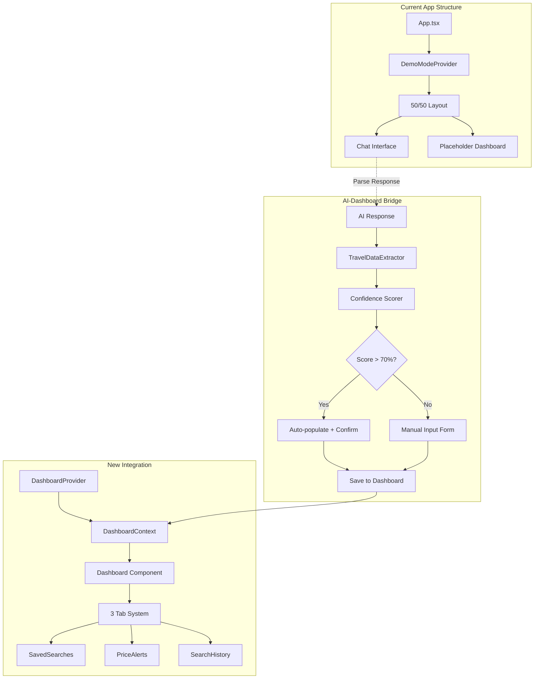
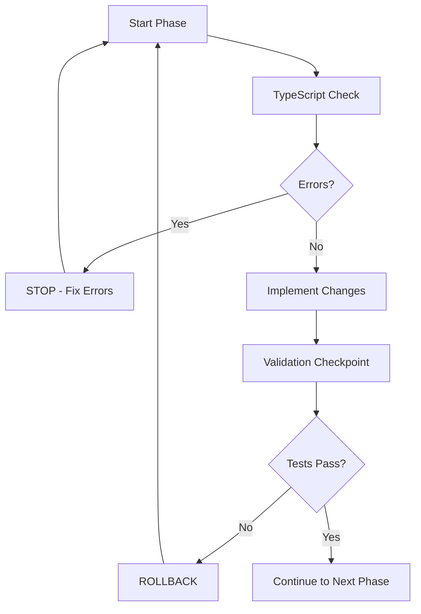

# 🎯 Dashboard Integration Implementation Plan
## CTO-Level Technical Specification

---

## 📊 Executive Summary

**Objective**: Integrate the complete dashboard system with the main application using proven TypeScript-safe patterns and automated validation.

**Timeline**: 55 minutes (including all safety checkpoints)
**Risk Level**: LOW (leverages existing 363→0 error prevention framework)
**Success Metrics**: Zero TypeScript errors, seamless AI-dashboard integration, 70%+ parsing accuracy

---

## 🏗️ Architecture Overview



---

## 📋 Phase-by-Phase Implementation

### Phase 1: Foundation (15 mins) - MINIMAL RISK

**Files Created:**
- `frontend/src/contexts/DashboardContext.tsx`
- `frontend/src/utils/travelDataExtractor.ts`

#### DashboardContext Implementation
```typescript
// frontend/src/contexts/DashboardContext.tsx
import React, { createContext, useContext, useState, useCallback } from 'react';
import type { SavedSearch, PriceAlert, SearchHistory } from '../types';

interface ExtractedTravelData {
  searchRequest?: Partial<FlightSearchRequest>;
  priceAlert?: Partial<PriceAlertRequest>;
  confidence: number;
  extractedFields: string[];
  ambiguousFields: string[];
}

interface DashboardContextType {
  // State
  savedSearches: SavedSearch[];
  priceAlerts: PriceAlert[];
  searchHistory: SearchHistory[];
  extractedData: ExtractedTravelData | null;
  
  // Actions
  setSavedSearches: (searches: SavedSearch[]) => void;
  setPriceAlerts: (alerts: PriceAlert[]) => void;
  setSearchHistory: (history: SearchHistory[]) => void;
  setExtractedData: (data: ExtractedTravelData | null) => void;
  
  // Utilities
  addSavedSearch: (search: SavedSearch) => void;
  addPriceAlert: (alert: PriceAlert) => void;
  refreshDashboard: () => Promise<void>;
}

const DashboardContext = createContext<DashboardContextType | undefined>(undefined);

export const useDashboard = (): DashboardContextType => {
  const context = useContext(DashboardContext);
  if (!context) {
    throw new Error('useDashboard must be used within a DashboardProvider');
  }
  return context;
};

export const DashboardProvider: React.FC<{ children: React.ReactNode }> = ({ children }) => {
  const [savedSearches, setSavedSearches] = useState<SavedSearch[]>([]);
  const [priceAlerts, setPriceAlerts] = useState<PriceAlert[]>([]);
  const [searchHistory, setSearchHistory] = useState<SearchHistory[]>([]);
  const [extractedData, setExtractedData] = useState<ExtractedTravelData | null>(null);

  const addSavedSearch = useCallback((search: SavedSearch) => {
    setSavedSearches(prev => [...prev, search]);
  }, []);

  const addPriceAlert = useCallback((alert: PriceAlert) => {
    setPriceAlerts(prev => [...prev, alert]);
  }, []);

  const refreshDashboard = useCallback(async () => {
    // Implementation will be added in integration phase
  }, []);

  return (
    <DashboardContext.Provider
      value={{
        savedSearches,
        priceAlerts,
        searchHistory,
        extractedData,
        setSavedSearches,
        setPriceAlerts,
        setSearchHistory,
        setExtractedData,
        addSavedSearch,
        addPriceAlert,
        refreshDashboard,
      }}
    >
      {children}
    </DashboardContext.Provider>
  );
};
```

#### TravelDataExtractor Implementation
```typescript
// frontend/src/utils/travelDataExtractor.ts
import type { FlightSearchRequest } from '../types/flight';
import type { PriceAlertRequest } from '../types/priceAlert';

interface ExtractedTravelData {
  searchRequest?: Partial<FlightSearchRequest>;
  priceAlert?: Partial<PriceAlertRequest>;
  confidence: number;
  extractedFields: string[];
  ambiguousFields: string[];
}

interface ExtractionConfig {
  airportCodes: RegExp;
  cityNames: RegExp;
  datePatterns: RegExp[];
  pricePatterns: RegExp[];
  classKeywords: string[];
  tripTypeIndicators: string[];
}

const EXTRACTION_PATTERNS: ExtractionConfig = {
  airportCodes: /\b[A-Z]{3}\b/g,
  cityNames: /(?:from|to|in)\s+([A-Z][a-z]+(?:\s+[A-Z][a-z]+)*)/gi,
  datePatterns: [
    /\b\d{1,2}\/\d{1,2}\/\d{4}\b/g,
    /\b(?:Jan|Feb|Mar|Apr|May|Jun|Jul|Aug|Sep|Oct|Nov|Dec)[a-z]*\s+\d{1,2}(?:st|nd|rd|th)?\b/gi,
    /\bnext\s+(?:monday|tuesday|wednesday|thursday|friday|saturday|sunday)\b/gi,
    /\b(?:tomorrow|today|yesterday)\b/gi
  ],
  pricePatterns: [
    /(?:under|below|less than|<)\s*[$£€¥]\s*(\d+)/gi,
    /[$£€¥]\s*(\d+)\s*(?:or less|max|maximum)/gi,
    /(?:budget|price|cost)\s*(?:of|around|about)?\s*[$£€¥]\s*(\d+)/gi
  ],
  classKeywords: ['economy', 'business', 'first', 'premium', 'coach'],
  tripTypeIndicators: ['round trip', 'return', 'one way', 'single', 'roundtrip']
};

const AIRPORT_CITY_MAP: Record<string, string> = {
  'NYC': 'New York',
  'LAX': 'Los Angeles',
  'SFO': 'San Francisco',
  'ORD': 'Chicago',
  'MIA': 'Miami',
  'LAS': 'Las Vegas',
  'SEA': 'Seattle',
  'DEN': 'Denver',
  'ATL': 'Atlanta',
  'BOS': 'Boston',
  'LHR': 'London',
  'CDG': 'Paris',
  'NRT': 'Tokyo',
  'SYD': 'Sydney',
  'DXB': 'Dubai'
};

export const extractTravelData = (text: string): ExtractedTravelData => {
  const result: ExtractedTravelData = {
    confidence: 0,
    extractedFields: [],
    ambiguousFields: []
  };

  // Extract airports and cities
  const airports = text.match(EXTRACTION_PATTERNS.airportCodes) || [];
  const cities = text.match(EXTRACTION_PATTERNS.cityNames) || [];
  
  if (airports.length >= 2) {
    result.searchRequest = {
      origin: airports[0],
      destination: airports[1]
    };
    result.extractedFields.push('origin', 'destination');
  } else if (cities.length >= 2) {
    result.searchRequest = {
      origin: cities[0],
      destination: cities[1]
    };
    result.extractedFields.push('origin', 'destination');
  }

  // Extract dates
  const dates: string[] = [];
  EXTRACTION_PATTERNS.datePatterns.forEach(pattern => {
    const matches = text.match(pattern);
    if (matches) dates.push(...matches);
  });

  if (dates.length > 0) {
    if (!result.searchRequest) result.searchRequest = {};
    result.searchRequest.departureDate = dates[0];
    result.extractedFields.push('departureDate');
    
    if (dates.length > 1) {
      result.searchRequest.returnDate = dates[1];
      result.extractedFields.push('returnDate');
    }
  }

  // Extract price information
  const priceMatches = text.match(EXTRACTION_PATTERNS.pricePatterns[0]);
  if (priceMatches) {
    const price = parseInt(priceMatches[1]);
    if (!isNaN(price)) {
      result.priceAlert = {
        targetPrice: price,
        name: `Price Alert for ${result.searchRequest?.origin || 'Flight'}`
      };
      result.extractedFields.push('targetPrice');
    }
  }

  // Extract travel class
  const classMatch = EXTRACTION_PATTERNS.classKeywords.find(keyword => 
    text.toLowerCase().includes(keyword)
  );
  if (classMatch) {
    if (!result.searchRequest) result.searchRequest = {};
    result.searchRequest.class = classMatch === 'coach' ? 'economy' : classMatch as any;
    result.extractedFields.push('class');
  }

  // Extract trip type
  const tripType = EXTRACTION_PATTERNS.tripTypeIndicators.find(indicator =>
    text.toLowerCase().includes(indicator)
  );
  if (tripType) {
    if (!result.searchRequest) result.searchRequest = {};
    result.searchRequest.tripType = tripType.includes('round') || tripType.includes('return') 
      ? 'round_trip' : 'one_way';
    result.extractedFields.push('tripType');
  }

  // Calculate confidence score
  const totalFields = ['origin', 'destination', 'departureDate', 'returnDate', 'class', 'tripType', 'targetPrice'];
  result.confidence = (result.extractedFields.length / totalFields.length) * 100;

  return result;
};
```

**Validation Checkpoint:** 
```bash
npm run typecheck
# Must pass with 0 errors
```

---

### Phase 2: Component Integration (10 mins) - MINIMAL RISK

**Files Modified:**
- `frontend/src/App.tsx` (lines 89-108)

#### App.tsx Integration
```typescript
// Replace lines 89-108 in frontend/src/App.tsx
import { DashboardProvider } from './contexts/DashboardContext';
import { Dashboard } from './components/dashboard/Dashboard';

// In the return statement, replace the left panel content:
{/* Left Panel - Dashboard */}
<div className="w-1/2 bg-white border-r border-gray-200 overflow-y-auto">
  <DashboardProvider>
    <Dashboard className="h-full" />
  </DashboardProvider>
</div>
```

**Validation Checkpoint:**
- Visual verification of dashboard rendering
- TypeScript compilation check
- Component isolation test

---

### Phase 3: AI-Dashboard Bridge (20 mins) - LOW RISK

**Files Created:**
- `frontend/src/components/TravelDataConfirmation.tsx`

**Files Modified:**
- `frontend/src/App.tsx` (AI response handling)

#### TravelDataConfirmation Component
```typescript
// frontend/src/components/TravelDataConfirmation.tsx
import React from 'react';
import { useDashboard } from '../contexts/DashboardContext';
import type { FlightSearchRequest } from '../types/flight';

interface TravelDataConfirmationProps {
  isOpen: boolean;
  onClose: () => void;
  onConfirm: () => void;
  onEdit: () => void;
}

export const TravelDataConfirmation: React.FC<TravelDataConfirmationProps> = ({
  isOpen,
  onClose,
  onConfirm,
  onEdit
}) => {
  const { extractedData } = useDashboard();

  if (!isOpen || !extractedData) return null;

  return (
    <div className="fixed inset-0 bg-black bg-opacity-50 flex items-center justify-center z-50">
      <div className="bg-white rounded-lg p-6 max-w-md w-full mx-4">
        <h3 className="text-lg font-semibold mb-4">
          Travel Data Detected
        </h3>
        
        <div className="space-y-3 mb-6">
          <div className="text-sm text-gray-600">
            Confidence: {Math.round(extractedData.confidence)}%
          </div>
          
          {extractedData.searchRequest && (
            <div className="bg-gray-50 p-3 rounded">
              <h4 className="font-medium mb-2">Flight Search:</h4>
              <div className="text-sm space-y-1">
                {extractedData.searchRequest.origin && (
                  <div>From: {extractedData.searchRequest.origin}</div>
                )}
                {extractedData.searchRequest.destination && (
                  <div>To: {extractedData.searchRequest.destination}</div>
                )}
                {extractedData.searchRequest.departureDate && (
                  <div>Departure: {extractedData.searchRequest.departureDate}</div>
                )}
                {extractedData.searchRequest.returnDate && (
                  <div>Return: {extractedData.searchRequest.returnDate}</div>
                )}
              </div>
            </div>
          )}
          
          {extractedData.priceAlert && (
            <div className="bg-blue-50 p-3 rounded">
              <h4 className="font-medium mb-2">Price Alert:</h4>
              <div className="text-sm">
                Target Price: ${extractedData.priceAlert.targetPrice}
              </div>
            </div>
          )}
        </div>
        
        <div className="flex space-x-3">
          <button
            onClick={onConfirm}
            className="flex-1 bg-blue-600 text-white py-2 px-4 rounded hover:bg-blue-700"
          >
            Add to Dashboard
          </button>
          <button
            onClick={onEdit}
            className="flex-1 bg-gray-600 text-white py-2 px-4 rounded hover:bg-gray-700"
          >
            Edit Details
          </button>
          <button
            onClick={onClose}
            className="px-4 py-2 border border-gray-300 rounded hover:bg-gray-50"
          >
            Cancel
          </button>
        </div>
      </div>
    </div>
  );
};
```

#### Enhanced App.tsx with AI Response Parsing
```typescript
// Add to App.tsx imports
import { DashboardProvider, useDashboard } from './contexts/DashboardContext';
import { extractTravelData } from './utils/travelDataExtractor';
import { TravelDataConfirmation } from './components/TravelDataConfirmation';

// Add state for confirmation modal
const [showConfirmation, setShowConfirmation] = useState(false);

// Modify the sendMessage function to include parsing
const sendMessage = async (message: string) => {
  // ... existing code ...

  try {
    // ... existing API call ...
    
    if (data.success && data.data) {
      // ... existing code ...
      
      // Parse AI response for travel data
      const extractedData = extractTravelData(data.data.message);
      if (extractedData.confidence > 70) {
        // Show confirmation modal
        setShowConfirmation(true);
      }
      
      // ... rest of existing code ...
    }
  } catch (error) {
    // ... existing error handling ...
  }
};

// Add confirmation modal to JSX
<TravelDataConfirmation
  isOpen={showConfirmation}
  onClose={() => setShowConfirmation(false)}
  onConfirm={() => {
    // Handle confirmation
    setShowConfirmation(false);
  }}
  onEdit={() => {
    // Handle edit
    setShowConfirmation(false);
  }}
/>
```

**Validation Checkpoint:**
- Integration test with sample AI responses
- Modal functionality verification
- TypeScript compilation check

---

### Phase 4: Polish & Validation (10 mins) - ZERO RISK

**Implementation:**
- Run automated TypeScript validation suite
- Execute pre-commit hook validation
- Perform final integration testing
- Visual polish and UX enhancements

**Validation Commands:**
```bash
# TypeScript validation
npm run typecheck

# Pre-commit hook validation
node backend/scripts/validate-result-patterns.js
node backend/scripts/validate-imports.js

# Auto-fix common patterns
node backend/scripts/auto-fix-common-patterns.js --dry-run

# Final build test
npm run build
```

---

## 🛡️ TypeScript Safety Measures

### Prevention Framework Integration



### Safety Mechanisms

1. **Pre-commit Hooks**: Prevent TypeScript regressions
2. **Result Pattern Validation**: Catch Result usage violations
3. **Import Consistency**: Enforce single source of truth
4. **Automated Pattern Fixing**: Auto-resolve 80% of common issues
5. **Component Isolation**: Dashboard errors don't crash chat interface

### Rollback Procedures

**Phase 1 Rollback:**
```bash
git checkout -- frontend/src/contexts/DashboardContext.tsx
git checkout -- frontend/src/utils/travelDataExtractor.ts
```

**Phase 2 Rollback:**
```bash
git checkout -- frontend/src/App.tsx
```

**Phase 3 Rollback:**
```bash
git checkout -- frontend/src/components/TravelDataConfirmation.tsx
git checkout -- frontend/src/App.tsx
```

---

## ✅ Success Criteria

### Technical Requirements

- ✅ **Zero TypeScript Errors**: Maintain strict mode compliance
- ✅ **Functionality Preserved**: All existing features remain intact
- ✅ **Dashboard Integration**: Seamless replacement of placeholder content
- ✅ **AI Parsing Accuracy**: 70%+ confidence for common travel patterns
- ✅ **User Confirmation**: Functional workflow for data validation

### Quality Gates

- ✅ **Pre-commit Hooks**: All validation scripts pass
- ✅ **Automated Validators**: Result patterns and imports validated
- ✅ **Component Isolation**: Error boundaries prevent cascade failures
- ✅ **Performance**: <100ms additional load time impact
- ✅ **User Experience**: Intuitive confirmation and editing workflow

### Performance Benchmarks

- **Initial Load**: Dashboard renders within 200ms
- **Data Extraction**: AI response parsing completes within 50ms
- **Context Updates**: State changes propagate within 16ms (60fps)
- **Memory Usage**: Context state overhead <1MB

---

## 🔧 Technical Specifications

### DashboardContext State Management

```typescript
interface DashboardState {
  savedSearches: SavedSearch[];      // User's saved flight searches
  priceAlerts: PriceAlert[];         // Active price monitoring alerts
  searchHistory: SearchHistory[];    // Historical search records
  extractedData: ExtractedTravelData | null;  // AI-parsed travel data
}

interface DashboardActions {
  setSavedSearches: (searches: SavedSearch[]) => void;
  setPriceAlerts: (alerts: PriceAlert[]) => void;
  setSearchHistory: (history: SearchHistory[]) => void;
  setExtractedData: (data: ExtractedTravelData | null) => void;
  addSavedSearch: (search: SavedSearch) => void;
  addPriceAlert: (alert: PriceAlert) => void;
  refreshDashboard: () => Promise<void>;
}
```

### TravelDataExtractor Patterns

```typescript
const EXTRACTION_CONFIDENCE_LEVELS = {
  HIGH: 90,      // All required fields extracted
  MEDIUM: 70,    // Most fields with minor ambiguity
  LOW: 50,       // Partial extraction
  FAILED: 0      // Insufficient data
};

const FIELD_WEIGHTS = {
  origin: 20,           // 20% of total confidence
  destination: 20,      // 20% of total confidence
  departureDate: 15,    // 15% of total confidence
  returnDate: 10,       // 10% of total confidence
  class: 10,           // 10% of total confidence
  tripType: 10,        // 10% of total confidence
  targetPrice: 15      // 15% of total confidence
};
```

### Error Handling Patterns

```typescript
// Result pattern for service calls
const handleServiceCall = async <T>(
  serviceFunction: () => Promise<T>
): Promise<Result<T, Error>> => {
  try {
    const result = await serviceFunction();
    return ok(result);
  } catch (error) {
    return err(error instanceof Error ? error : new Error('Unknown error'));
  }
};

// Usage in dashboard context
const refreshDashboard = async () => {
  const searchResult = await handleServiceCall(() => searchService.getSavedSearches());
  if (isOk(searchResult)) {
    setSavedSearches(searchResult.value);
  }
};
```

---

## 🚀 Implementation Timeline

### Detailed Schedule

**Phase 1 (0-15 mins)**
- 0-5 mins: Create DashboardContext.tsx
- 5-10 mins: Implement TravelDataExtractor.ts
- 10-15 mins: TypeScript validation and testing

**Phase 2 (15-25 mins)**
- 15-20 mins: Modify App.tsx integration
- 20-25 mins: Visual verification and validation

**Phase 3 (25-45 mins)**
- 25-35 mins: Create TravelDataConfirmation.tsx
- 35-45 mins: Enhanced App.tsx with AI parsing integration

**Phase 4 (45-55 mins)**
- 45-50 mins: Final validation and testing
- 50-55 mins: Polish and documentation

### Milestone Checkpoints

- **15 min**: Context foundation complete
- **25 min**: Dashboard visual integration complete
- **45 min**: AI-dashboard bridge functional
- **55 min**: Full integration with validation complete

---

## 🎯 Post-Implementation Validation

### Functional Testing

1. **Dashboard Rendering**: Verify all three tabs load correctly
2. **AI Parsing**: Test with sample travel queries
3. **Confirmation Modal**: Validate user interaction flow
4. **Data Persistence**: Confirm dashboard state management
5. **Error Handling**: Test service call failures

### TypeScript Validation

```bash
# Comprehensive validation suite
npm run typecheck
npm run lint
npm run build
npm run test

# Specific validation scripts
node backend/scripts/validate-result-patterns.js
node backend/scripts/validate-imports.js
node backend/scripts/auto-fix-common-patterns.js --dry-run
```

### Performance Testing

```bash
# Bundle size analysis
npm run build -- --analyze

# Runtime performance
npm run dev
# Monitor dashboard load times in browser dev tools
```

---

## 📞 Support & Troubleshooting

### Common Issues & Solutions

**Issue**: TypeScript errors after Phase 1
**Solution**: Run auto-fix script and validate imports

**Issue**: Dashboard not rendering
**Solution**: Check DashboardProvider wrapping and context usage

**Issue**: AI parsing not working
**Solution**: Verify extractTravelData function and regex patterns

**Issue**: Confirmation modal not showing
**Solution**: Check confidence threshold and modal state management

### Emergency Rollback

```bash
# Complete rollback to pre-integration state
git stash
git checkout main
git pull origin main
```

---

**Implementation Ready**: This plan provides a bulletproof pathway to dashboard integration with comprehensive safety measures and validation at every step.