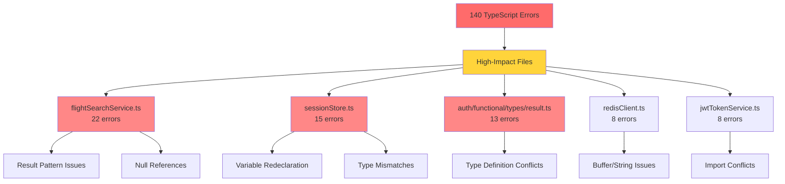
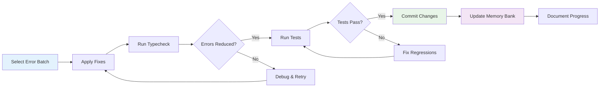

# 🎯 TypeScript Error Resolution Implementation Plan
## Systematic Approach to Zero Errors - Agentic Travel Agent MVP

**Status**: Ready for Implementation  
**Current Errors**: 140 across 26 files  
**Target**: 0 TypeScript errors  
**Strategy**: Three-phase systematic reduction with parallel execution capability  
**Created**: June 28, 2025

---

## 📊 Executive Summary

### Current Situation
- **Error Count**: 140 TypeScript errors confirmed via `npm run typecheck`
- **Historical Progress**: Successfully reduced from ~363 → 196 → 140 errors
- **Blocking Issue**: Zero TypeScript errors required for production deployment
- **Quality Standard**: TypeScript strict mode enforcement throughout codebase

### Strategic Approach
- **Three-Phase Plan**: Quick Wins → Result Pattern → Complex Types
- **Parallel Execution**: Leverage large swarm for efficient parallel processing
- **Progress Documentation**: Continuous Memory Bank updates
- **Crash Resilience**: Frequent commits and progress tracking for VS Code stability

---

## 🚀 Three-Phase Implementation Strategy

### Phase 1: Quick Wins (Target: 15-20 errors)
**Priority**: Immediate  
**Risk Level**: Low  
**Parallel Execution**: High potential  
**Estimated Time**: 2-3 hours

#### Specific Targets:
1. **Import Conflicts** (8 errors)
   - **File**: [`backend/src/services/jwt/jwtTokenService.ts:6`](backend/src/services/jwt/jwtTokenService.ts:6)
   - **Fix**: Remove duplicate `Result`, `ok`, `err` imports
   - **Standard**: Use `@/utils/result` as single source of truth

2. **Variable Redeclaration** (7 errors)
   - **File**: [`backend/src/services/redis/sessionStore.ts:203`](backend/src/services/redis/sessionStore.ts:203)
   - **Fix**: Rename `sessionIdsResultString` conflicts
   - **Pattern**: Use descriptive, unique variable names

3. **Syntax Corrections** (5 errors)
   - **Files**: Multiple locations
   - **Fix**: Correct `null[0]` references and function call syntax
   - **Validation**: Immediate typecheck feedback

#### Parallel Execution Strategy:
- **Batch A**: Import conflicts (jwtTokenService.ts)
- **Batch B**: Variable redeclaration (sessionStore.ts)  
- **Batch C**: Syntax errors (distributed across files)

### Phase 2: Result Pattern Standardization (Target: 30-40 errors)
**Priority**: Core Architecture  
**Risk Level**: Medium  
**Parallel Execution**: Medium potential  
**Estimated Time**: 4-5 hours

#### Specific Targets:
1. **Missing Guards** (25 errors)
   - **Primary File**: [`backend/src/services/flights/flightSearchService.ts:281`](backend/src/services/flights/flightSearchService.ts:281)
   - **Fix**: Add `isOk()/isErr()` checks before property access
   - **Pattern**: Replace `.success` and `.data` with proper Result pattern

2. **Direct Property Access** (15 errors)
   - **Files**: Auth services, flight services
   - **Fix**: Implement proper Result guards before `.value/.error` access
   - **Standard**: Consistent Result pattern usage throughout

#### Implementation Pattern:
```typescript
// ❌ Before: Direct property access
if (result.success && result.data) {
  return result.data;
}

// ✅ After: Proper Result pattern
if (isOk(result)) {
  return result.value;
} else {
  return err(result.error);
}
```

### Phase 3: Complex Type System Fixes (Target: Remaining ~80 errors)
**Priority**: Production Readiness  
**Risk Level**: Medium-High  
**Parallel Execution**: Low-Medium potential  
**Estimated Time**: 6-8 hours

#### Specific Targets:
1. **Date/String Conversions** (25 errors)
   - **Files**: Auth services, session management
   - **Fix**: Convert `Date` objects to ISO strings
   - **Pattern**: `expiresAt: new Date().toISOString()`

2. **Redis Type Compatibility** (8 errors)
   - **File**: [`backend/src/services/redis/redisClient.ts:126`](backend/src/services/redis/redisClient.ts:126)
   - **Fix**: Handle `Buffer | string` return types
   - **Pattern**: Convert Buffer to string where needed

3. **JWT/Auth Type Issues** (10+ errors)
   - **Files**: JWT services, auth services
   - **Fix**: Resolve JWT payload type mismatches
   - **Standard**: Consistent authentication type handling

---

## 🔧 Parallel Execution Framework

### High-Priority Files for Parallel Processing


### Parallel Execution Batches
1. **Batch Alpha**: Import conflicts (jwtTokenService.ts) + Syntax errors
2. **Batch Beta**: Variable redeclaration (sessionStore.ts) + Type definitions
3. **Batch Gamma**: Result pattern fixes (flightSearchService.ts)
4. **Batch Delta**: Redis type issues (redisClient.ts) + Date conversions
5. **Batch Echo**: Auth service type fixes + JWT issues

---

## 📋 Implementation Workflow

### Per-Batch Execution Process


### Quality Gates
1. **Pre-Implementation**: Confirm error count with `npm run typecheck`
2. **Per-Batch**: Validate error reduction after each batch
3. **Per-Phase**: Full test suite execution
4. **Post-Implementation**: Zero errors confirmation

### Progress Documentation Strategy
- **Memory Bank Updates**: After each significant batch completion
- **Decision Logging**: Document any architectural decisions made during fixes
- **Progress Tracking**: Update error counts and completion percentages
- **Crash Recovery**: Frequent commits with descriptive messages for VS Code stability

---

## 🎯 Success Metrics & Validation

### Technical Targets
- **TypeScript Errors**: 0 (from current 140)
- **Build Success**: Clean `npm run typecheck` execution
- **Test Coverage**: Maintain existing 100% coverage
- **Code Quality**: Zero ESLint errors maintained

### Progress Milestones
- **Phase 1 Complete**: ~120-125 errors remaining
- **Phase 2 Complete**: ~80-90 errors remaining
- **Phase 3 Complete**: 0 errors remaining

### Validation Commands
```bash
# Error count validation
npm run typecheck

# Test coverage maintenance
npm run test

# Code quality validation
npm run lint

# Full validation suite
npm run typecheck && npm run test && npm run lint
```

---

## ⚠️ Risk Mitigation & Crash Resilience

### Identified Risks
1. **VS Code Crashes**: Frequent during intensive TypeScript work
2. **Breaking Changes**: Result pattern modifications could affect functionality
3. **Type Complexity**: Some errors may require architectural decisions
4. **Parallel Conflicts**: Multiple fixes in same files

### Mitigation Strategies
1. **Frequent Commits**: Commit after each successful batch (3-5 errors)
2. **Memory Bank Updates**: Document progress continuously
3. **Test Validation**: Run tests after each batch
4. **Rollback Plan**: Git commits enable easy reversion
5. **Progress Tracking**: Detailed error count tracking for recovery

### Crash Recovery Protocol
1. **Check Last Commit**: Verify last successful batch completion
2. **Run Typecheck**: Confirm current error count
3. **Review Memory Bank**: Check progress documentation
4. **Resume Strategy**: Continue from last documented checkpoint

---

## 📈 Expected Timeline & Resource Allocation

### Total Estimated Time: 12-16 hours
- **Phase 1**: 2-3 hours (Quick wins, high parallel potential)
- **Phase 2**: 4-5 hours (Result pattern, medium parallel potential)
- **Phase 3**: 6-8 hours (Complex types, lower parallel potential)

### Parallel Execution Benefits
- **Reduced Timeline**: Potential 30-40% time reduction with effective parallelization
- **Risk Distribution**: Multiple workstreams reduce single-point-of-failure risk
- **Progress Momentum**: Continuous error reduction across multiple fronts

### Resource Requirements
- **Large Swarm Capability**: Leverage parallel processing for maximum efficiency
- **Memory Bank Maintenance**: Continuous documentation updates
- **Quality Assurance**: Regular validation checkpoints

---

## 🚀 Implementation Readiness Checklist

### Pre-Implementation Setup
- [x] Memory Bank fully established and documented
- [x] Current error count confirmed (140 errors)
- [x] High-priority files identified
- [x] Error categories mapped to resolution strategies
- [x] Parallel execution batches defined

### Implementation Prerequisites
- [x] Systematic approach documented
- [x] Quality gates established
- [x] Progress tracking methodology defined
- [x] Crash resilience strategy in place
- [x] Success criteria clearly defined

### Ready for Code Mode Execution
- [x] Comprehensive plan approved
- [x] Parallel execution strategy defined
- [x] Memory Bank documentation complete
- [x] Risk mitigation strategies established

---

**Status**: ✅ READY FOR IMPLEMENTATION  
**Next Step**: Switch to Code mode for systematic error resolution execution  
**Approach**: Leverage large swarm for efficient parallel processing with continuous progress documentation

---

## 📝 Implementation Notes

### Key Patterns to Maintain
- **Result Pattern**: Consistent `isOk()/isErr()` usage
- **Functional Programming**: Pure functions with dependency injection
- **Type Safety**: Branded types and strict TypeScript compliance
- **Error Handling**: Comprehensive error wrapping and propagation

### Documentation Requirements
- Update Memory Bank after each phase completion
- Document any architectural decisions made during implementation
- Track error reduction progress with specific counts
- Maintain decision log for future reference

**Ready to execute systematic TypeScript error resolution with parallel processing capability.**