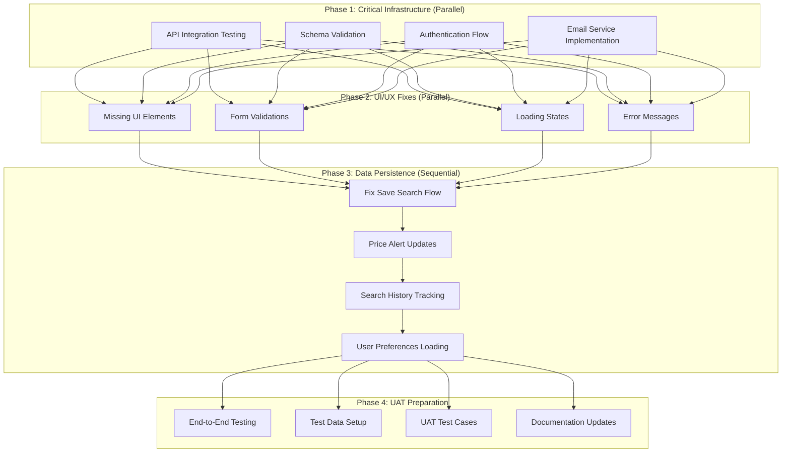

# 🎯 UAT Readiness Implementation Plan
## Agentic Travel Agent MVP

**Date**: January 7, 2025  
**Objective**: Systematically address all issues blocking User Acceptance Testing  
**Strategy**: Parallel execution with 4 specialized swarms (10 agents total)

---

## 📊 Current State Analysis

### Project Status
- **All 6 MVP features technically implemented** but with critical integration issues
- **0 TypeScript errors** (successfully reduced from 363)
- **Multiple failures** preventing proper functionality:
  - Missing UI elements
  - API connectivity issues  
  - Frontend/backend field mismatches
  - Incomplete backend implementations (TODOs)

### Critical Issues Blocking UAT

#### 1. **Integration Issues** (CRITICAL PRIORITY)
- Missing fields in API requests/responses (children, infants, etc.)
- Frontend/backend schema mismatches
- Authentication token propagation failures
- API endpoint connectivity problems (404 errors)

#### 2. **Missing UI Elements** (HIGH PRIORITY)
- Save Search button visibility issues
- Confirmation modals not appearing
- Form validation feedback missing
- Loading states not implemented

#### 3. **Backend Service Gaps** (CRITICAL PRIORITY)
- Email service only has mock implementation
- User email lookup returns test data only
- Price monitoring using hardcoded emails
- Cost tracking alerts not persisted

#### 4. **Data Flow Problems** (HIGH PRIORITY)
- Saved searches not persisting across sessions
- Price alerts not updating dashboard
- Search history missing entries
- User preferences not loading correctly

---

## 🚀 Parallel Execution Strategy



---

## 👥 Swarm Assignment & Responsibilities

### **Swarm 1: API Integration Team** (3 agents)
```yaml
Agent 1 - API Schema Validator:
  Focus: Request/Response Schema Alignment
  Tasks:
    - Audit all API endpoints for schema compliance
    - Fix field mismatches (origin vs originLocationCode, etc.)
    - Add missing fields (children, infants, flexibility)
    - Validate all payloads against Zod schemas
    - Create schema documentation

Agent 2 - Authentication Debugger:
  Focus: End-to-End Auth Flow
  Tasks:
    - Trace JWT token propagation through all layers
    - Fix Bearer token missing in API calls
    - Ensure session persistence across refreshes
    - Test protected endpoint authorization
    - Document auth flow

Agent 3 - Integration Tester:
  Focus: API Contract Validation
  Tasks:
    - Create comprehensive integration test suite
    - Test all endpoints with realistic payloads
    - Validate error response formats
    - Test rate limiting and timeouts
    - Generate API contract documentation
```

### **Swarm 2: Backend Services Team** (2 agents)
```yaml
Agent 4 - Email Service Engineer:
  Focus: Real Email Implementation
  Tasks:
    - Replace mock email with SMTP implementation
    - Implement user email lookup from database
    - Test all email templates (price alerts, confirmations)
    - Add email rate limiting and retry logic
    - Validate email delivery

Agent 5 - Batch Processing Specialist:
  Focus: Price Monitoring System
  Tasks:
    - Fix priceMonitoringProcessor email retrieval
    - Implement database storage for alerts
    - Test cron job execution (6-hour intervals)
    - Add monitoring and logging
    - Verify alert generation logic
```

### **Swarm 3: Frontend UI Team** (3 agents)
```yaml
Agent 6 - UI Component Auditor:
  Focus: Missing UI Elements
  Tasks:
    - Locate all missing UI components
    - Fix Save Search button visibility logic
    - Ensure modals render correctly
    - Add missing form fields
    - Verify responsive design

Agent 7 - UX Flow Optimizer:
  Focus: User Experience Enhancement
  Tasks:
    - Add loading spinners to async operations
    - Implement toast notifications for success/error
    - Add helpful error messages
    - Fix navigation flow issues
    - Implement progress indicators

Agent 8 - Form Validation Expert:
  Focus: Input Validation & Feedback
  Tasks:
    - Add comprehensive client-side validation
    - Implement real-time field validation
    - Add helpful validation messages
    - Test edge cases and boundaries
    - Ensure accessibility compliance
```

### **Swarm 4: Data Persistence Team** (2 agents)
```yaml
Agent 9 - State Management Debugger:
  Focus: Frontend State Synchronization
  Tasks:
    - Debug saved search persistence flow
    - Fix price alert dashboard updates
    - Trace search history recording
    - Debug preference loading issues
    - Implement proper state management

Agent 10 - Database Integration Specialist:
  Focus: Backend Data Operations
  Tasks:
    - Verify all CRUD operations work correctly
    - Fix data synchronization timing issues
    - Add proper transaction handling
    - Test concurrent update scenarios
    - Implement data consistency checks
```

---

## ✅ UAT Success Criteria

### Functional Requirements Checklist
- [ ] **Flight Search**: Natural language queries return accurate results
- [ ] **Search Results**: All fields displayed (price, times, airlines, etc.)
- [ ] **Save Search**: Button visible and saves persist across sessions
- [ ] **Price Alerts**: Alerts created and emails sent when prices drop
- [ ] **User Preferences**: Settings apply to searches correctly
- [ ] **Search History**: All searches tracked and displayed
- [ ] **Dashboard**: Real-time data updates without refresh
- [ ] **Authentication**: Login persists, protected routes work

### Non-Functional Requirements
- [ ] **Performance**: All API calls complete within 3 seconds
- [ ] **Reliability**: No console errors during normal use
- [ ] **Usability**: Clear error messages for all failures
- [ ] **Feedback**: Loading states for all async operations
- [ ] **Responsiveness**: Mobile design works correctly
- [ ] **Security**: Authentication tokens handled securely

### UAT Test Scenarios
1. **New User Journey**
   - Register account
   - Search for flights using natural language
   - Save interesting search
   - Set price alert threshold
   - Receive email when price drops

2. **Returning User Flow**
   - Login with existing account
   - View saved searches in dashboard
   - Modify price alert threshold
   - Check search history
   - Update preferences

3. **Error Handling**
   - Invalid search queries
   - API timeout scenarios
   - Network disconnection
   - Invalid form inputs
   - Authentication expiry

4. **Preference Management**
   - Set notification preferences
   - Configure default search options
   - Change display settings
   - Reset to defaults
   - Verify changes apply

5. **Batch Processing**
   - Wait for scheduled price check
   - Verify email notifications sent
   - Check dashboard updates
   - Validate alert accuracy

---

## 🎯 Priority Matrix

| Issue Category | Priority | Blocks UAT? | Swarm | Dependencies |
|----------------|----------|-------------|--------|--------------|
| API Schema Mismatches | CRITICAL | Yes | Swarm 1 | None |
| Missing Email Service | CRITICAL | Yes | Swarm 2 | None |
| Authentication Flow | CRITICAL | Yes | Swarm 1 | None |
| Save Search Persistence | CRITICAL | Yes | Swarm 4 | API fixes |
| Missing UI Elements | HIGH | Yes | Swarm 3 | None |
| Loading States | HIGH | No | Swarm 3 | None |
| Form Validations | MEDIUM | No | Swarm 3 | None |
| Search History | MEDIUM | No | Swarm 4 | API fixes |
| Error Messages | MEDIUM | No | Swarm 3 | None |

---

## 📋 Implementation Phases

### Phase 1: Critical Infrastructure (Parallel Execution)
**Swarms**: 1 & 2  
**Focus**: Fix blocking issues that prevent basic functionality
- API integration and schema alignment
- Authentication token propagation
- Email service implementation
- Batch processing fixes

### Phase 2: UI/UX Improvements (Parallel Execution)
**Swarm**: 3  
**Focus**: Fix user-facing issues
- Missing UI elements
- Loading states and feedback
- Form validation
- Error messaging

### Phase 3: Data Flow Fixes (Sequential Execution)
**Swarm**: 4  
**Focus**: Ensure data persists and syncs correctly
1. Save search persistence (depends on API fixes)
2. Price alert updates
3. Search history tracking
4. User preference loading

### Phase 4: UAT Preparation (All Teams)
**All Swarms**: Collaborative effort
- Comprehensive end-to-end testing
- Test data setup
- UAT scenario documentation
- Final bug fixes
- Documentation updates

---

## 🔄 Coordination Strategy

### Communication Protocol
1. **Checkpoint Syncs**: Every 2 hours for progress updates
2. **Blocker Alerts**: Immediate notification of dependencies
3. **Memory Bank Updates**: Document all discoveries in activeContext.md
4. **Integration Points**: Coordinate when swarms need to integrate work

### Quality Assurance
1. **Continuous Testing**: Run tests after each fix
2. **TypeScript Validation**: Maintain 0 errors
3. **Code Review**: Cross-swarm reviews for integration points
4. **Documentation**: Update as fixes are implemented

### Progress Tracking
- Update `progress.md` with completed tasks
- Mark off UAT criteria as achieved
- Track blockers in `activeContext.md`
- Document decisions in `decisionLog.md`

---

## 🚦 Risk Mitigation

### Identified Risks
1. **Integration Conflicts**: Multiple swarms modifying shared code
   - *Mitigation*: Clear ownership boundaries, frequent integration
   
2. **Cascading Failures**: One fix breaking another feature
   - *Mitigation*: Comprehensive test coverage, careful validation
   
3. **Schema Drift**: Frontend/backend getting out of sync
   - *Mitigation*: Shared type definitions, automated validation

4. **Time Pressure**: Rush to complete may introduce bugs
   - *Mitigation*: Systematic approach, proper testing

---

## 📊 Monitoring & Metrics

### Progress Indicators
- Number of UAT criteria passed
- API endpoints validated
- UI components fixed
- Test scenarios passing
- TypeScript errors (must stay at 0)

### Success Metrics
- All functional requirements met
- All test scenarios pass
- No critical bugs remaining
- Documentation complete
- Ready for UAT sign-off

---

## 🎬 Next Steps

Upon approval of this plan:
1. Deploy all 4 swarms simultaneously
2. Begin Phase 1 & 2 parallel execution
3. Set up coordination channels
4. Start progress tracking
5. Schedule first checkpoint sync

This systematic approach with parallel execution will accelerate the path to UAT readiness while maintaining quality and preventing regressions.