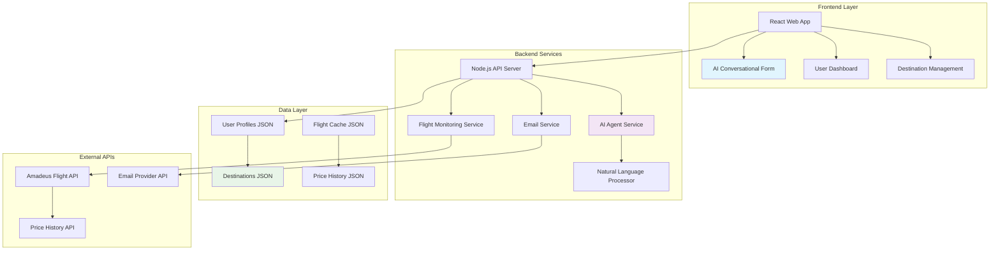
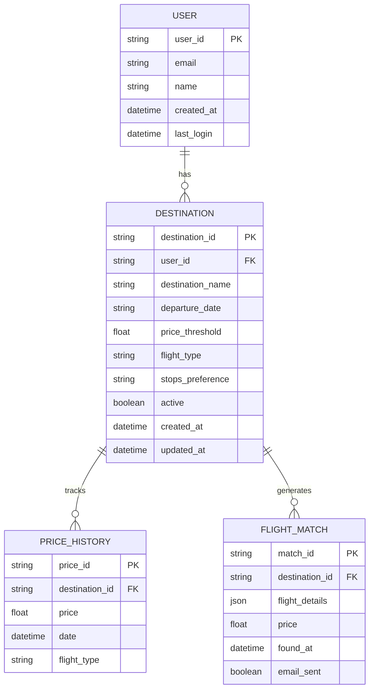
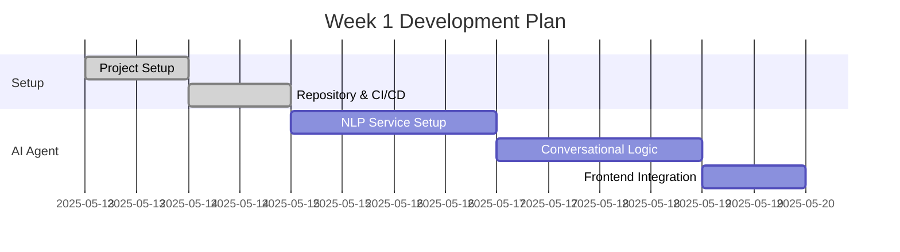
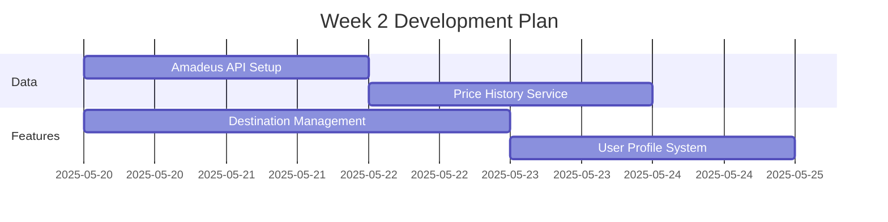
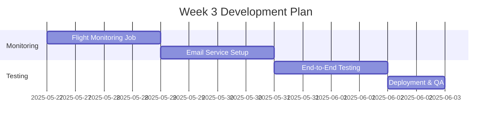

# Agentic Travel Agent MVP - Technical Architecture & Implementation Plan

## Document Control
- **Document Status:** Final Architecture Plan
- **Version:** 2.0
- **Date:** June 22, 2025
- **Original PRD Date:** May 13, 2025
- **Target Completion:** June 6, 2025

## Executive Summary

This document provides a comprehensive technical architecture and implementation plan for the refined Agentic Travel Agent MVP. The plan focuses on an AI-powered conversational interface that helps users set up flight monitoring for multiple destinations with intelligent price tracking and email notifications.

## 📋 Refined MVP Scope Definition

### Core Features
- **AI-powered conversational form** for destination setup
- **Multiple destinations per user** with individual criteria
- **Single price threshold per destination** (applies to both one-way and round-trip)
- **Historical and projected pricing display** (3 months back/forward via Amadeus API)
- **Flight preferences**: non-stop, 1-stop, or 2-stops
- **Exact date specification** for departures
- **Email notifications with flight details** (no booking links)
- **User profile management** with add/edit/delete destination capabilities
- **File-based destination storage** for MVP simplicity

### Key Requirements Validation
✅ **Timeline**: 3 weeks (May 13 - June 6, 2025)  
✅ **AI Agent**: Natural language processing with guided conversational form  
✅ **Pricing**: Single threshold with historical context for informed decisions  
✅ **Notifications**: Email-only with flight details for manual booking  
✅ **Data Storage**: File-based system for rapid MVP development  

## 🏗️ Technical Architecture



### Architecture Components

#### Frontend Layer
- **React Web Application**: Modern, responsive interface
- **AI Conversational Form**: Guided natural language input processing
- **User Dashboard**: Overview of all monitored destinations
- **Destination Management**: CRUD operations for flight alerts

#### Backend Services
- **Node.js API Server**: RESTful API handling all business logic
- **AI Agent Service**: Natural language processing and conversation management
- **Flight Monitoring Service**: Scheduled price checking and alert generation
- **Email Service**: Notification delivery system

#### Data Layer
- **File-based JSON storage** for rapid MVP development
- **User profiles, destinations, flight cache, and price history**
- **Structured for easy migration to database post-MVP**

#### External Integrations
- **Amadeus API**: Flight data and pricing information
- **Email Provider**: Reliable notification delivery
- **OAuth Provider**: User authentication (Google)

## 🤖 AI Agent Conversational Flow

```mermaid
flowchart TD
    A[User Input: "I want to go to Paris"] --> B{Parse Intent}
    B --> C[Extract Destination: Paris]
    C --> D[Ask: "When would you like to travel?"]
    D --> E[User: "March 15th"]
    E --> F[Ask: "What's your budget for flights?"]
    F --> G[User: "$800"]
    G --> H[Show Historical Prices]
    H --> I[Ask: "Direct flights only or connections OK?"]
    I --> J[User: "1 stop is fine"]
    J --> K[Ask: "Round-trip or one-way?"]
    K --> L[Confirm & Save Destination]
    L --> M[Add to User Profile]
    
    style A fill:#e3f2fd
    style H fill:#fff3e0
    style M fill:#e8f5e8
```

### Conversation Examples

#### Example 1: New Destination Setup
```
Agent: "Hi! I'd love to help you set up flight monitoring. Where would you like to go?"
User: "I want to visit Tokyo sometime in April"
Agent: "Great choice! What specific date in April are you thinking?"
User: "April 20th"
Agent: "Perfect! What's your budget for flights to Tokyo?"
User: "Around $1200"
Agent: "Let me show you recent prices... [displays 3-month history]. Your budget looks reasonable! Do you prefer direct flights or are connections okay?"
User: "Direct flights preferred"
Agent: "Got it! Round-trip or one-way?"
User: "Round-trip"
Agent: "Excellent! I've set up monitoring for: Tokyo on April 20th, round-trip, direct flights, budget $1200. You'll get an email when I find matching flights!"
```

#### Example 2: Price Context Guidance
```
Agent: "What's your budget for flights to London?"
User: "Is $600 reasonable?"
Agent: "Let me check recent prices... [shows chart] 
- Last 3 months average: $720
- Lowest price: $580
- Projected next 3 months: $650-$750
Your $600 budget is good - you'll catch deals when they appear!"
```

## 📊 Data Structure Design



### File-Based Data Storage Structure

```
data/
├── users/
│   ├── user_123.json
│   └── user_456.json
├── destinations/
│   ├── dest_abc.json
│   └── dest_def.json
├── price_history/
│   ├── paris_2025.json
│   └── tokyo_2025.json
└── flight_matches/
    ├── matches_2025_05.json
    └── matches_2025_06.json
```

#### Sample Data Files

**User Profile (user_123.json)**
```json
{
  "user_id": "user_123",
  "email": "john@example.com",
  "name": "John Doe",
  "created_at": "2025-05-13T10:00:00Z",
  "last_login": "2025-05-20T14:30:00Z",
  "destinations": ["dest_abc", "dest_def"]
}
```

**Destination (dest_abc.json)**
```json
{
  "destination_id": "dest_abc",
  "user_id": "user_123",
  "destination_name": "Tokyo",
  "departure_date": "2025-04-20",
  "price_threshold": 1200.00,
  "flight_type": "round-trip",
  "stops_preference": "direct",
  "active": true,
  "created_at": "2025-05-13T10:15:00Z",
  "updated_at": "2025-05-13T10:15:00Z"
}
```

## 🔧 Implementation Timeline (3 Weeks)

### Week 1: Foundation & AI Agent



#### Days 1-2: Project Foundation
- ✅ Set up React + Node.js project structure
- ✅ Configure development environment and tooling
- ✅ Set up file-based data storage system
- ✅ Implement basic authentication (Google OAuth)
- ✅ Create project repository and CI/CD pipeline

#### Days 3-5: AI Agent Development
- 🤖 Implement natural language processing service
- 🤖 Create conversational flow logic and state management
- 🤖 Build guided form interface with conversation UI
- 🤖 Test conversation scenarios and edge cases
- 🤖 Implement intent recognition and entity extraction

#### Days 6-7: Frontend Integration
- 🎨 Connect AI agent to React frontend
- 🎨 Create user dashboard skeleton
- 🎨 Implement basic destination display
- 🎨 Add responsive design and mobile optimization

### Week 2: Core Features & Data Integration



#### Days 8-10: Amadeus API Integration
- 🛫 Set up Amadeus API credentials and sandbox environment
- 🛫 Implement flight search functionality
- 🛫 Create price history retrieval service
- 🛫 Build price display components with historical context
- 🛫 Implement API error handling and rate limiting

#### Days 11-14: Destination Management
- 📝 Complete destination CRUD operations
- 📝 Implement file-based storage for user data
- 📝 Create destination editing interface
- 📝 Add price threshold validation with historical context
- 📝 Implement user profile management system

### Week 3: Monitoring & Notifications



#### Days 15-17: Flight Monitoring System
- ⏰ Implement scheduled job for flight price checking
- ⏰ Create email notification templates
- ⏰ Set up email service integration (SendGrid/Mailgun)
- ⏰ Test notification delivery and tracking
- ⏰ Implement monitoring dashboard for system health

#### Days 18-21: Testing & Deployment
- 🧪 Comprehensive end-to-end testing
- 🧪 User acceptance testing with real scenarios
- 🧪 Performance optimization and load testing
- 🧪 Security review and vulnerability assessment
- 🚀 Production deployment and monitoring setup

## 📧 Email Notification System

### Email Template Design

```
Subject: ✈️ Flight Alert: Tokyo flights found under $1200!

Hi [Name],

Great news! I found flights matching your criteria:

🎯 Destination: Tokyo
📅 Date: April 20, 2025
💰 Price: $1,150 (under your $1,200 budget!)
✈️ Flight: Direct, Round-trip
🏢 Airline: United Airlines
⏰ Departure: 2:30 PM - Arrival: 6:45 PM (+1 day)

Flight Details:
- Outbound: LAX → NRT (11h 15m)
- Return: NRT → LAX (9h 30m)
- Aircraft: Boeing 787

This price is 8% below your threshold and 15% lower than last month's average.

Happy travels!
Your Travel Agent 🤖
```

### Email Service Integration
- **Provider**: SendGrid or Mailgun for reliability
- **Templates**: HTML and text versions
- **Tracking**: Open rates and engagement metrics
- **Frequency**: Maximum one email per destination per day
- **Unsubscribe**: Easy opt-out mechanism

## 🔍 Technical Risk Assessment

| Risk | Impact | Probability | Mitigation Strategy |
|------|--------|-------------|-------------------|
| Amadeus API Rate Limits | High | Medium | Implement intelligent caching, batch requests, monitor usage |
| AI Agent Accuracy | Medium | High | Extensive testing, fallback to structured forms, user feedback loop |
| File Storage Scalability | Medium | Low | Monitor file sizes, implement archiving, plan database migration |
| Email Deliverability | High | Low | Use established provider, implement delivery tracking, monitor reputation |
| Natural Language Processing | Medium | Medium | Start simple, improve iteratively, provide guided examples |
| Authentication Security | High | Low | Use OAuth best practices, implement session management |
| Performance Bottlenecks | Medium | Medium | Implement monitoring, optimize critical paths, load testing |

### Risk Mitigation Details

#### Amadeus API Integration
- **Sandbox Testing**: Extensive testing in sandbox environment
- **Rate Limiting**: Implement exponential backoff and request queuing
- **Caching Strategy**: Cache flight data for 4-6 hours to reduce API calls
- **Fallback Plan**: Mock data service for development and testing

#### AI Agent Reliability
- **Intent Recognition**: Start with simple keyword matching, improve over time
- **Conversation State**: Robust state management with error recovery
- **User Guidance**: Provide examples and suggestions for better input
- **Fallback Options**: Traditional form interface as backup

## 📈 Success Metrics & KPIs

### Technical Metrics
- **AI Agent Conversation Completion Rate**: >80%
- **Flight Data Accuracy**: >95%
- **Email Delivery Rate**: >98%
- **System Uptime**: >99%
- **API Response Time**: <2 seconds
- **Page Load Time**: <3 seconds

### User Experience Metrics
- **Destination Setup Completion**: >70%
- **User Return Rate After First Alert**: >40%
- **Email Open Rate**: >35%
- **Email Click-through Rate**: >15%
- **Average Destinations per User**: 2-3
- **User Satisfaction Score**: >4.0/5.0

### Business Metrics
- **Total Active Users**: 100+ by end of MVP
- **Total Destinations Monitored**: 200+
- **Successful Flight Matches**: 50+
- **Email Notifications Sent**: 500+
- **User Retention (7-day)**: >60%

## 🚀 Technology Stack

### Frontend
- **Framework**: React 18 with TypeScript
- **Styling**: Tailwind CSS for responsive design
- **State Management**: React Context API
- **HTTP Client**: Axios for API communication
- **Build Tool**: Vite for fast development

### Backend
- **Runtime**: Node.js 18+ with Express.js
- **Language**: TypeScript for type safety
- **Authentication**: Passport.js with Google OAuth
- **Email Service**: SendGrid SDK
- **Scheduling**: node-cron for periodic tasks
- **Validation**: Joi for input validation

### External Services
- **Flight Data**: Amadeus API
- **Authentication**: Google OAuth 2.0
- **Email Delivery**: SendGrid
- **Hosting**: Vercel (frontend) + Railway (backend)
- **Monitoring**: Sentry for error tracking

### Development Tools
- **Version Control**: Git with GitHub
- **CI/CD**: GitHub Actions
- **Code Quality**: ESLint, Prettier
- **Testing**: Jest, React Testing Library
- **Documentation**: JSDoc, Markdown

## 🔄 Post-MVP Roadmap

### Phase 2: Enhanced Features (Weeks 4-6)
- **Database Migration**: Move from files to PostgreSQL
- **Multiple Flight Types**: Support for multi-city trips
- **Advanced AI**: Improved natural language understanding
- **Mobile App**: React Native application
- **User Preferences**: Learning from user behavior

### Phase 3: Scale & Monetization (Weeks 7-12)
- **Booking Integration**: Direct booking capabilities
- **Premium Features**: Advanced alerts and analytics
- **Hotel Monitoring**: Expand to accommodation tracking
- **API Platform**: Allow third-party integrations
- **Revenue Streams**: Affiliate commissions, subscriptions

### Long-term Vision
- **Multi-modal Travel**: Trains, buses, car rentals
- **Group Travel**: Collaborative trip planning
- **Travel Insights**: Predictive analytics and recommendations
- **Global Expansion**: Multi-language and currency support
- **Enterprise Solutions**: Corporate travel management

## 📚 Development Guidelines

### Code Standards
- **TypeScript**: Strict mode enabled
- **ESLint**: Airbnb configuration
- **Prettier**: Consistent code formatting
- **Commit Messages**: Conventional commits format
- **Branch Strategy**: Git Flow with feature branches

### Testing Strategy
- **Unit Tests**: >80% code coverage
- **Integration Tests**: API endpoints and services
- **E2E Tests**: Critical user journeys
- **Performance Tests**: Load testing with realistic data
- **Security Tests**: OWASP compliance checks

### Documentation Requirements
- **API Documentation**: OpenAPI/Swagger specs
- **Code Documentation**: JSDoc for all functions
- **User Documentation**: Setup and usage guides
- **Architecture Documentation**: System design docs
- **Deployment Documentation**: Infrastructure setup

## 🎯 Conclusion

This comprehensive plan provides a realistic and achievable approach to building the Agentic Travel Agent MVP within the 3-week timeline. The focus on AI-powered conversational interfaces, combined with robust flight monitoring and notification systems, creates a solid foundation for future growth.

**Key Success Factors:**
1. **Simplified but Functional**: Focus on core value proposition
2. **AI-First Approach**: Natural language interface reduces friction
3. **Realistic Timeline**: Achievable milestones with buffer time
4. **Scalable Architecture**: File-based storage with clear migration path
5. **User-Centric Design**: Conversational flow matches user mental model

The plan balances technical complexity with delivery timeline, ensuring a functional MVP that validates the core concept while providing a foundation for future enhancements.

---

**Document Status**: ✅ Final Architecture Plan  
**Next Steps**: Begin implementation following the detailed timeline  
**Review Schedule**: Weekly progress reviews with stakeholder feedback