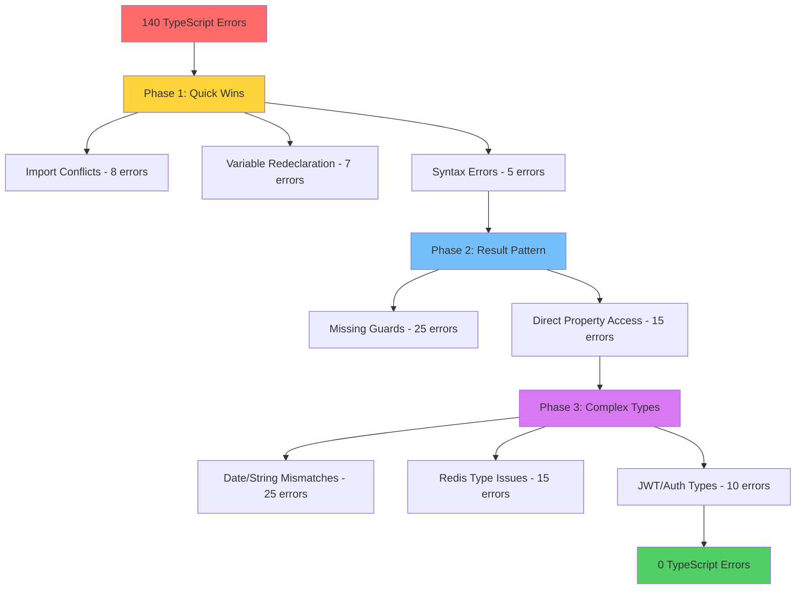

# 🏗️ System Patterns
## Agentic Travel Agent MVP

**Architecture Patterns & Technical Standards**  
**Focus**: TypeScript Error Resolution & Code Quality Patterns  
**Last Updated**: June 28, 2025

---

## 🎯 Core Architectural Patterns

### Result Pattern Implementation
```typescript
// Standard Result type definition
type Result<T, E> = Ok<T> | Err<E>;
type Ok<T> = { readonly ok: true; readonly value: T };
type Err<E> = { readonly ok: false; readonly error: E };

// Mandatory usage pattern
const result = await someOperation();
if (isOk(result)) {
  // Safe to access result.value
  console.log(result.value);
} else {
  // Handle error case
  console.error(result.error);
}
```

**Pattern Rules**:
- ✅ Always use `isOk()/isErr()` guards before accessing `.value/.error`
- ❌ Never access `.value/.error` directly without guards
- ✅ Consistent Result type imports from `@/utils/result`
- ❌ Avoid duplicate Result type definitions across files

### Functional Programming Patterns
```typescript
// Pure function with dependency injection
interface Dependencies {
  storage: StorageService;
  logger: Logger;
}

const createUser = (deps: Dependencies) => 
  async (userData: UserData): Promise<Result<User, AppError>> => {
    // Implementation with injected dependencies
  };

// Branded types for type safety
type UserId = string & { readonly brand: 'UserId' };
type Email = string & { readonly brand: 'Email' };
type SessionId = string & { readonly brand: 'SessionId' };
```

### Date/Time Standardization Pattern
```typescript
// Standard: Use ISO strings for API boundaries
interface UserSession {
  id: SessionId;
  userId: UserId;
  createdAt: string;    // ISO 8601 string
  expiresAt: string;    // ISO 8601 string
  lastAccessedAt: string; // ISO 8601 string
}

// Convert Date objects to ISO strings
const now = new Date();
const session = {
  createdAt: now.toISOString(),
  expiresAt: new Date(Date.now() + 900000).toISOString()
};
```

---

## 🔧 Error Resolution Patterns

### Import Conflict Resolution
```typescript
// ❌ Problematic: Duplicate imports
import { Result, ok, err } from './types';
import { Result, ok, err, isOk, isErr } from '@/utils/result';

// ✅ Correct: Single source of truth
import { Result, ok, err, isOk, isErr } from '@/utils/result';
```

### Variable Redeclaration Fixes
```typescript
// ❌ Problematic: Variable redeclaration
const sessionIdsResultString = await this.redisClient.get(userSessionsKey);
const sessionIdsResultString = sessionIdsResult.value ? sessionIdsResult.value.toString() : null;

// ✅ Correct: Unique variable names
const sessionIdsResult = await this.redisClient.get(userSessionsKey);
const sessionIdsString = isOk(sessionIdsResult) ? sessionIdsResult.value.toString() : null;
```

### Result Pattern Guard Implementation
```typescript
// ❌ Problematic: Direct property access
if (result.success && result.data) {
  return result.data;
}

// ✅ Correct: Proper Result pattern guards
if (isOk(result)) {
  return result.value;
} else {
  return err(result.error);
}
```

### Type Conversion Patterns
```typescript
// ❌ Problematic: Type mismatch
const response: Result<string, AppError> = ok(buffer); // Buffer assigned to string

// ✅ Correct: Proper type conversion
const response: Result<string, AppError> = ok(buffer.toString());

// Date to string conversion
const expiresAt: string = new Date(Date.now() + 900000).toISOString();
```

---

## 📊 Error Resolution Workflow

### Phase-Based Error Resolution


### Error Categorization System
1. **Syntax/Import Errors** (Priority 1): Quick fixes, no logic changes
2. **Pattern Violations** (Priority 2): Result pattern standardization
3. **Type System Issues** (Priority 3): Complex type conversions and compatibility

---

## 🎯 Quality Assurance Patterns

### Testing During Error Resolution
```typescript
// Maintain test coverage during fixes
describe('Error Resolution Validation', () => {
  it('should maintain functionality after type fixes', async () => {
    const result = await serviceMethod();
    expect(isOk(result)).toBe(true);
    if (isOk(result)) {
      expect(result.value).toBeDefined();
    }
  });
});
```

### Progress Validation Pattern
```bash
# After each batch of fixes
npm run typecheck  # Validate error reduction
npm run test       # Ensure no functionality regression
npm run lint       # Maintain code quality standards
```

### Batch Processing Strategy
- **Batch Size**: 5-10 errors per iteration
- **Validation**: Typecheck after each batch
- **Rollback Plan**: Git commits per batch for easy reversion
- **Documentation**: Update Memory Bank with significant decisions

---

## 🔒 Code Quality Patterns

### TypeScript Strict Mode Compliance
```typescript
// Strict null checks
const user: User | null = await getUser(id);
if (user !== null) {
  // Safe to use user
  console.log(user.name);
}

// Strict property initialization
class UserService {
  private readonly storage: StorageService;
  
  constructor(storage: StorageService) {
    this.storage = storage; // Must initialize all properties
  }
}
```

### Error Handling Consistency
```typescript
// Standard error creation pattern
const createAppError = (code: string, message: string, details?: unknown): AppError => ({
  statusCode: 500,
  name: 'AppError',
  message,
  code,
  details
});

// Consistent error wrapping
const wrapServiceError = (operation: string) => (error: unknown): AppError =>
  createAppError('SERVICE_ERROR', `${operation} failed`, { originalError: error });
```

---

## 📈 Pattern Evolution

**[2025-06-28 23:48:00]** - TypeScript Error Resolution Patterns Established
- Documented systematic approach to Result pattern standardization
- Established import conflict resolution strategy
- Created phase-based error resolution workflow
- Defined quality assurance patterns for error fixing process

---

## 🎯 Pattern Compliance Checklist

### Before Implementing Fixes
- [ ] Identify error category and appropriate pattern
- [ ] Plan batch size and validation strategy
- [ ] Ensure Result pattern consistency
- [ ] Validate import organization

### During Implementation
- [ ] Apply appropriate resolution pattern
- [ ] Maintain functional programming principles
- [ ] Preserve existing test coverage
- [ ] Document significant decisions

### After Implementation
- [ ] Validate error reduction with typecheck
- [ ] Run full test suite
- [ ] Update Memory Bank with progress
- [ ] Commit changes with descriptive messages

**[2025-06-29 11:50:44]** - TypeScript Error Prevention Framework Patterns Established
- **Automated Quality Gates**: Implemented 4-tier prevention system with pre-commit hooks, pattern validators, auto-fixers, and CI/CD integration
- **Pattern Coverage**: 80% automated fixes for Result pattern violations, import conflicts, Date/string mismatches, variable redeclarations, type mismatches, and null references
- **Sustainable Architecture**: Proactive error prevention replacing reactive error fixing approach with comprehensive documentation and team training materials
- **Framework Integration**: npm scripts integration (`validate`, `fix-patterns`, `setup-hooks`) for seamless developer workflow and long-term project quality sustainability